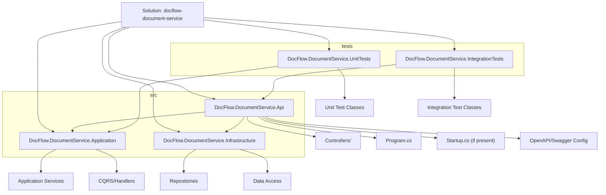

```mermaid
graph TD
    A["Solution: docflow-document-service"]
    subgraph src
        B["DocFlow.DocumentService.Api"]
        C["DocFlow.DocumentService.Application"]
        D["DocFlow.DocumentService.Infrastructure"]
    end
    subgraph tests
        E["DocFlow.DocumentService.UnitTests"]
        F["DocFlow.DocumentService.IntegrationTests"]
    end

    A --> B
    A --> C
    A --> D
    A --> E
    A --> F

    B --> C["References"]
    B --> D["References"]
    E --> C["References"]
    F --> B["References"]

    B["DocFlow.DocumentService.Api"] --> B1["Controllers/"]
    B["DocFlow.DocumentService.Api"] --> B2["Program.cs"]
    B["DocFlow.DocumentService.Api"] --> B3["Startup.cs (if present)"]
    B["DocFlow.DocumentService.Api"] --> B4["OpenAPI/Swagger Config"]
    C["DocFlow.DocumentService.Application"] --> C1["Application Services"]
    C["DocFlow.DocumentService.Application"] --> C2["CQRS/Handlers"]
    D["DocFlow.DocumentService.Infrastructure"] --> D1["Repositories"]
    D["DocFlow.DocumentService.Infrastructure"] --> D2["Data Access"]
    E["DocFlow.DocumentService.UnitTests"] --> E1["Unit Test Classes"]
    F["DocFlow.DocumentService.IntegrationTests"] --> F1["Integration Test Classes"]
```